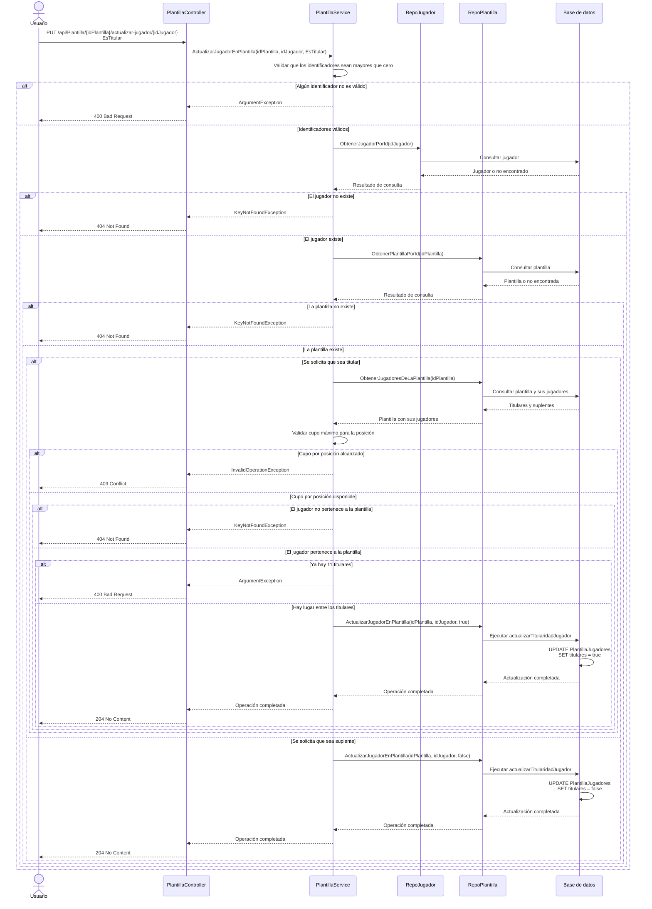

# Actualizar un jugador de una plantilla

```mermaid
sequenceDiagram
    actor Usuario
    participant API as PlantillaController
    participant Servicio as PlantillaService
    participant RepoJugador
    participant RepoPlantilla
    participant BD as Base de datos

    Usuario->>API: PUT /api/Plantilla/{idPlantilla}/actualizar-jugador/{idJugador}<br/>EsTitular
    API->>Servicio: ActualizarJugadorEnPlantilla(idPlantilla, idJugador, EsTitular)
    Servicio->>Servicio: Validar que los identificadores sean mayores que cero

    alt Algún identificador no es válido
        Servicio-->>API: ArgumentException
        API-->>Usuario: 400 Bad Request
    else Identificadores válidos
        Servicio->>RepoJugador: ObtenerJugadorPorId(idJugador)
        RepoJugador->>BD: Consultar jugador
        BD-->>RepoJugador: Jugador o no encontrado
        RepoJugador-->>Servicio: Resultado de consulta

        alt El jugador no existe
            Servicio-->>API: KeyNotFoundException
            API-->>Usuario: 404 Not Found
        else El jugador existe
            Servicio->>RepoPlantilla: ObtenerPlantillaPorId(idPlantilla)
            RepoPlantilla->>BD: Consultar plantilla
            BD-->>RepoPlantilla: Plantilla o no encontrada
            RepoPlantilla-->>Servicio: Resultado de consulta

            alt La plantilla no existe
                Servicio-->>API: KeyNotFoundException
                API-->>Usuario: 404 Not Found
            else La plantilla existe
                alt Se solicita que sea titular
                    Servicio->>RepoPlantilla: ObtenerJugadoresDeLaPlantilla(idPlantilla)
                    RepoPlantilla->>BD: Consultar plantilla y sus jugadores
                    BD-->>RepoPlantilla: Titulares y suplentes
                    RepoPlantilla-->>Servicio: Plantilla con sus jugadores
                    Servicio->>Servicio: Validar cupo máximo para la posición

                    alt Cupo por posición alcanzado
                        Servicio-->>API: InvalidOperationException
                        API-->>Usuario: 409 Conflict
                    else Cupo por posición disponible
                        alt El jugador no pertenece a la plantilla
                            Servicio-->>API: KeyNotFoundException
                            API-->>Usuario: 404 Not Found
                        else El jugador pertenece a la plantilla
                            alt Ya hay 11 titulares
                                Servicio-->>API: ArgumentException
                                API-->>Usuario: 400 Bad Request
                            else Hay lugar entre los titulares
                                Servicio->>RepoPlantilla: ActualizarJugadorEnPlantilla(idPlantilla, idJugador, true)
                                RepoPlantilla->>BD: Ejecutar actualizarTitularidadJugador
                                BD->>BD: UPDATE PlantillaJugadores<br/>SET titulares = true
                                BD-->>RepoPlantilla: Actualización completada
                                RepoPlantilla-->>Servicio: Operación completada
                                Servicio-->>API: Operación completada
                                API-->>Usuario: 204 No Content
                            end
                        end
                    end
                else Se solicita que sea suplente
                    Servicio->>RepoPlantilla: ActualizarJugadorEnPlantilla(idPlantilla, idJugador, false)
                    RepoPlantilla->>BD: Ejecutar actualizarTitularidadJugador
                    BD->>BD: UPDATE PlantillaJugadores<br/>SET titulares = false
                    BD-->>RepoPlantilla: Actualización completada
                    RepoPlantilla-->>Servicio: Operación completada
                    Servicio-->>API: Operación completada
                    API-->>Usuario: 204 No Content
                end
            end
        end
    end
```
