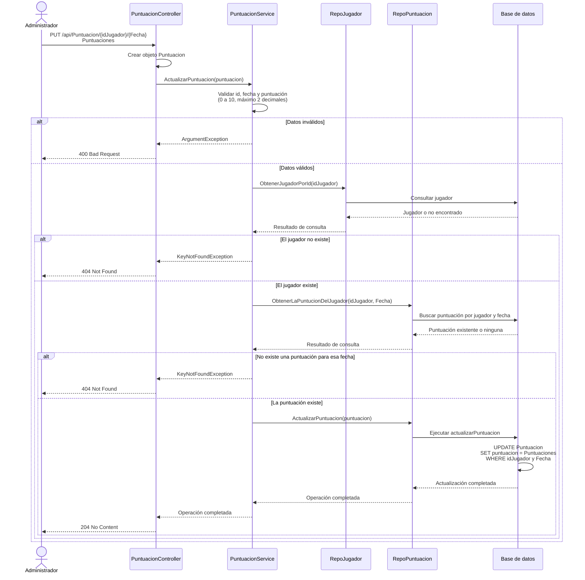

# Actualizar una puntuación de un jugador

```mermaid
sequenceDiagram
    actor Administrador
    participant API as PuntuacionController
    participant Servicio as PuntuacionService
    participant RepoJugador
    participant RepoPuntuacion
    participant BD as Base de datos

    Administrador->>API: PUT /api/Puntuacion/{idJugador}/{Fecha}<br/>Puntuaciones
    API->>API: Crear objeto Puntuacion
    API->>Servicio: ActualizarPuntuacion(puntuacion)
    Servicio->>Servicio: Validar id, fecha y puntuación<br/>(0 a 10, máximo 2 decimales)

    alt Datos inválidos
        Servicio-->>API: ArgumentException
        API-->>Administrador: 400 Bad Request
    else Datos válidos
        Servicio->>RepoJugador: ObtenerJugadorPorId(idJugador)
        RepoJugador->>BD: Consultar jugador
        BD-->>RepoJugador: Jugador o no encontrado
        RepoJugador-->>Servicio: Resultado de consulta

        alt El jugador no existe
            Servicio-->>API: KeyNotFoundException
            API-->>Administrador: 404 Not Found
        else El jugador existe
            Servicio->>RepoPuntuacion: ObtenerLaPuntucionDelJugador(idJugador, Fecha)
            RepoPuntuacion->>BD: Buscar puntuación por jugador y fecha
            BD-->>RepoPuntuacion: Puntuación existente o ninguna
            RepoPuntuacion-->>Servicio: Resultado de consulta

            alt No existe una puntuación para esa fecha
                Servicio-->>API: KeyNotFoundException
                API-->>Administrador: 404 Not Found
            else La puntuación existe
                Servicio->>RepoPuntuacion: ActualizarPuntuacion(puntuacion)
                RepoPuntuacion->>BD: Ejecutar actualizarPuntuacion
                BD->>BD: UPDATE Puntuacion<br/>SET puntuacion = Puntuaciones<br/>WHERE idJugador y Fecha
                BD-->>RepoPuntuacion: Actualización completada
                RepoPuntuacion-->>Servicio: Operación completada
                Servicio-->>API: Operación completada
                API-->>Administrador: 204 No Content
            end
        end
    end
```
