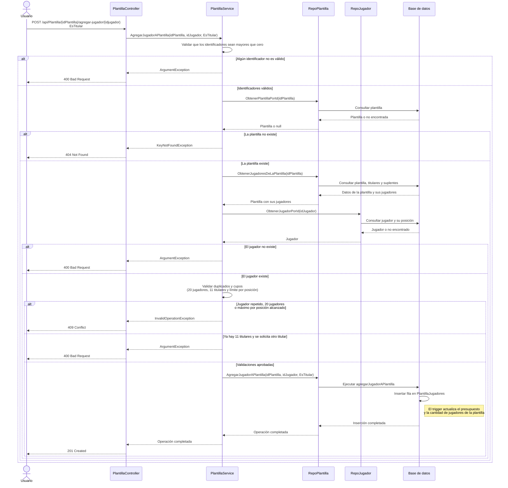

# Agregar un jugador a una plantilla

```mermaid
sequenceDiagram
    actor Usuario
    participant API as PlantillaController
    participant Servicio as PlantillaService
    participant RepoPlantilla
    participant RepoJugador
    participant BD as Base de datos

    Usuario->>API: POST /api/Plantilla/{idPlantilla}/agregar-jugador/{idjugador}<br/>EsTitular
    API->>Servicio: AgregarJugadorAPlantilla(idPlantilla, idJugador, EsTitular)
    Servicio->>Servicio: Validar que los identificadores sean mayores que cero

    alt Algún identificador no es válido
        Servicio-->>API: ArgumentException
        API-->>Usuario: 400 Bad Request
    else Identificadores válidos
        Servicio->>RepoPlantilla: ObtenerPlantillaPorId(idPlantilla)
        RepoPlantilla->>BD: Consultar plantilla
        BD-->>RepoPlantilla: Plantilla o no encontrada
        RepoPlantilla-->>Servicio: Plantilla o null

        alt La plantilla no existe
            Servicio-->>API: KeyNotFoundException
            API-->>Usuario: 404 Not Found
        else La plantilla existe
            Servicio->>RepoPlantilla: ObtenerJugadoresDeLaPlantilla(idPlantilla)
            RepoPlantilla->>BD: Consultar plantilla, titulares y suplentes
            BD-->>RepoPlantilla: Datos de la plantilla y sus jugadores
            RepoPlantilla-->>Servicio: Plantilla con sus jugadores

            Servicio->>RepoJugador: ObtenerJugadorPorId(idJugador)
            RepoJugador->>BD: Consultar jugador y su posición
            BD-->>RepoJugador: Jugador o no encontrado
            RepoJugador-->>Servicio: Jugador

            alt El jugador no existe
                Servicio-->>API: ArgumentException
                API-->>Usuario: 400 Bad Request
            else El jugador existe
                Servicio->>Servicio: Validar duplicados y cupos<br/>(20 jugadores, 11 titulares y límite por posición)

                alt Jugador repetido, 20 jugadores<br/>o máximo por posición alcanzado
                    Servicio-->>API: InvalidOperationException
                    API-->>Usuario: 409 Conflict
                else Ya hay 11 titulares y se solicita otro titular
                    Servicio-->>API: ArgumentException
                    API-->>Usuario: 400 Bad Request
                else Validaciones aprobadas
                    Servicio->>RepoPlantilla: AgregarJugadorAPlantilla(idPlantilla, idJugador, EsTitular)
                    RepoPlantilla->>BD: Ejecutar agregarJugadorAPlantilla
                    BD->>BD: Insertar fila en PlantillaJugadores
                    Note right of BD: El trigger actualiza el presupuesto<br/>y la cantidad de jugadores de la plantilla
                    BD-->>RepoPlantilla: Inserción completada
                    RepoPlantilla-->>Servicio: Operación completada
                    Servicio-->>API: Operación completada
                    API-->>Usuario: 201 Created
                end
            end
        end
    end
```
