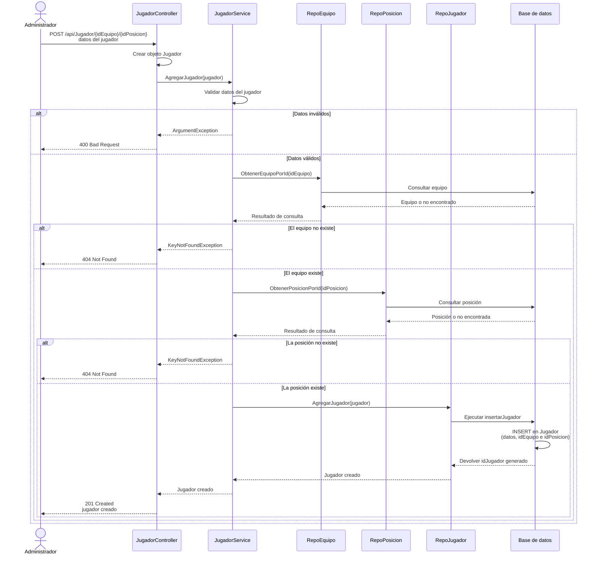

# Agregar un jugador

```mermaid
sequenceDiagram
    actor Administrador
    participant API as JugadorController
    participant Servicio as JugadorService
    participant RepoEquipo
    participant RepoPosicion
    participant RepoJugador
    participant BD as Base de datos

    Administrador->>API: POST /api/Jugador/{idEquipo}/{idPosicion}<br/>datos del jugador
    API->>API: Crear objeto Jugador
    API->>Servicio: AgregarJugador(jugador)
    Servicio->>Servicio: Validar datos del jugador

    alt Datos inválidos
        Servicio-->>API: ArgumentException
        API-->>Administrador: 400 Bad Request
    else Datos válidos
        Servicio->>RepoEquipo: ObtenerEquipoPorId(idEquipo)
        RepoEquipo->>BD: Consultar equipo
        BD-->>RepoEquipo: Equipo o no encontrado
        RepoEquipo-->>Servicio: Resultado de consulta

        alt El equipo no existe
            Servicio-->>API: KeyNotFoundException
            API-->>Administrador: 404 Not Found
        else El equipo existe
            Servicio->>RepoPosicion: ObtenerPosicionPorId(idPosicion)
            RepoPosicion->>BD: Consultar posición
            BD-->>RepoPosicion: Posición o no encontrada
            RepoPosicion-->>Servicio: Resultado de consulta

            alt La posición no existe
                Servicio-->>API: KeyNotFoundException
                API-->>Administrador: 404 Not Found
            else La posición existe
                Servicio->>RepoJugador: AgregarJugador(jugador)
                RepoJugador->>BD: Ejecutar insertarJugador
                BD->>BD: INSERT en Jugador<br/>(datos, idEquipo e idPosicion)
                BD-->>RepoJugador: Devolver idJugador generado
                RepoJugador-->>Servicio: Jugador creado
                Servicio-->>API: Jugador creado
                API-->>Administrador: 201 Created<br/>jugador creado
            end
        end
    end
```
