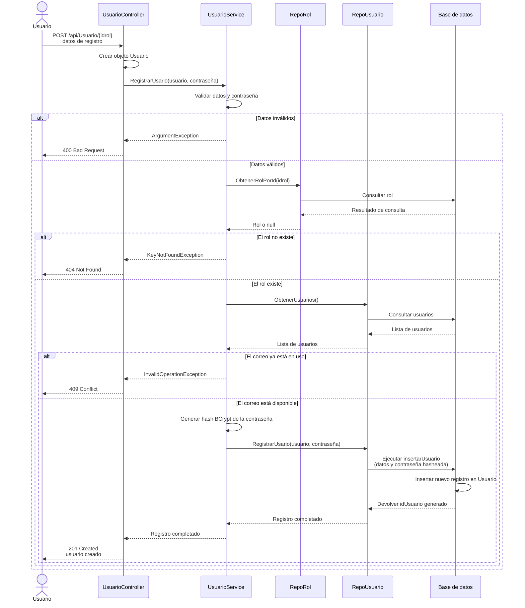

# Crear una cuenta

```mermaid
sequenceDiagram
    actor Usuario
    participant API as UsuarioController
    participant Servicio as UsuarioService
    participant RepoRol as RepoRol
    participant RepoUsuario as RepoUsuario
    participant BD as Base de datos

    Usuario->>API: POST /api/Usuario/{idrol}<br/>datos de registro
    API->>API: Crear objeto Usuario
    API->>Servicio: RegistrarUsario(usuario, contraseña)

    Servicio->>Servicio: Validar datos y contraseña
    alt Datos inválidos
        Servicio-->>API: ArgumentException
        API-->>Usuario: 400 Bad Request
    else Datos válidos
        Servicio->>RepoRol: ObtenerRolPorId(idrol)
        RepoRol->>BD: Consultar rol
        BD-->>RepoRol: Resultado de consulta
        RepoRol-->>Servicio: Rol o null

        alt El rol no existe
            Servicio-->>API: KeyNotFoundException
            API-->>Usuario: 404 Not Found
        else El rol existe
            Servicio->>RepoUsuario: ObtenerUsuarios()
            RepoUsuario->>BD: Consultar usuarios
            BD-->>RepoUsuario: Lista de usuarios
            RepoUsuario-->>Servicio: Lista de usuarios

            alt El correo ya está en uso
                Servicio-->>API: InvalidOperationException
                API-->>Usuario: 409 Conflict
            else El correo está disponible
                Servicio->>Servicio: Generar hash BCrypt de la contraseña
                Servicio->>RepoUsuario: RegistrarUsario(usuario, contraseña)
                RepoUsuario->>BD: Ejecutar insertarUsuario<br/>(datos y contraseña hasheada)
                BD->>BD: Insertar nuevo registro en Usuario
                BD-->>RepoUsuario: Devolver idUsuario generado
                RepoUsuario-->>Servicio: Registro completado
                Servicio-->>API: Registro completado
                API-->>Usuario: 201 Created<br/>usuario creado
            end
        end
    end
```
