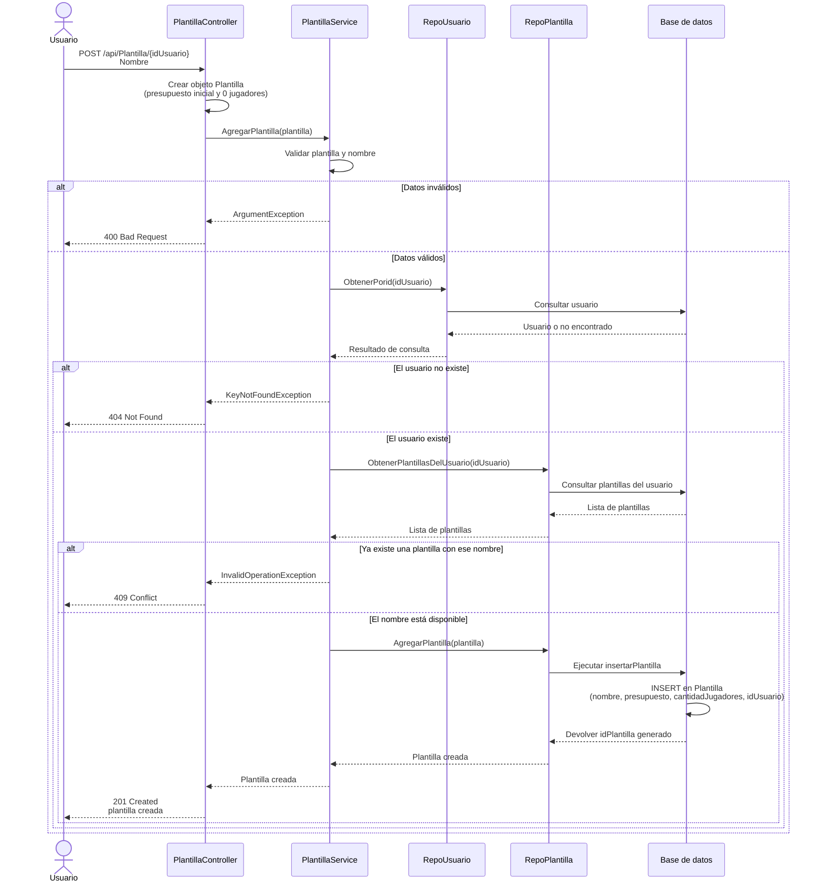

# Crear una plantilla

```mermaid
sequenceDiagram
    actor Usuario
    participant API as PlantillaController
    participant Servicio as PlantillaService
    participant RepoUsuario
    participant RepoPlantilla
    participant BD as Base de datos

    Usuario->>API: POST /api/Plantilla/{idUsuario}<br/>Nombre
    API->>API: Crear objeto Plantilla<br/>(presupuesto inicial y 0 jugadores)
    API->>Servicio: AgregarPlantilla(plantilla)
    Servicio->>Servicio: Validar plantilla y nombre

    alt Datos inválidos
        Servicio-->>API: ArgumentException
        API-->>Usuario: 400 Bad Request
    else Datos válidos
        Servicio->>RepoUsuario: ObtenerPorid(idUsuario)
        RepoUsuario->>BD: Consultar usuario
        BD-->>RepoUsuario: Usuario o no encontrado
        RepoUsuario-->>Servicio: Resultado de consulta

        alt El usuario no existe
            Servicio-->>API: KeyNotFoundException
            API-->>Usuario: 404 Not Found
        else El usuario existe
            Servicio->>RepoPlantilla: ObtenerPlantillasDelUsuario(idUsuario)
            RepoPlantilla->>BD: Consultar plantillas del usuario
            BD-->>RepoPlantilla: Lista de plantillas
            RepoPlantilla-->>Servicio: Lista de plantillas

            alt Ya existe una plantilla con ese nombre
                Servicio-->>API: InvalidOperationException
                API-->>Usuario: 409 Conflict
            else El nombre está disponible
                Servicio->>RepoPlantilla: AgregarPlantilla(plantilla)
                RepoPlantilla->>BD: Ejecutar insertarPlantilla
                BD->>BD: INSERT en Plantilla<br/>(nombre, presupuesto, cantidadJugadores, idUsuario)
                BD-->>RepoPlantilla: Devolver idPlantilla generado
                RepoPlantilla-->>Servicio: Plantilla creada
                Servicio-->>API: Plantilla creada
                API-->>Usuario: 201 Created<br/>plantilla creada
            end
        end
    end
```
