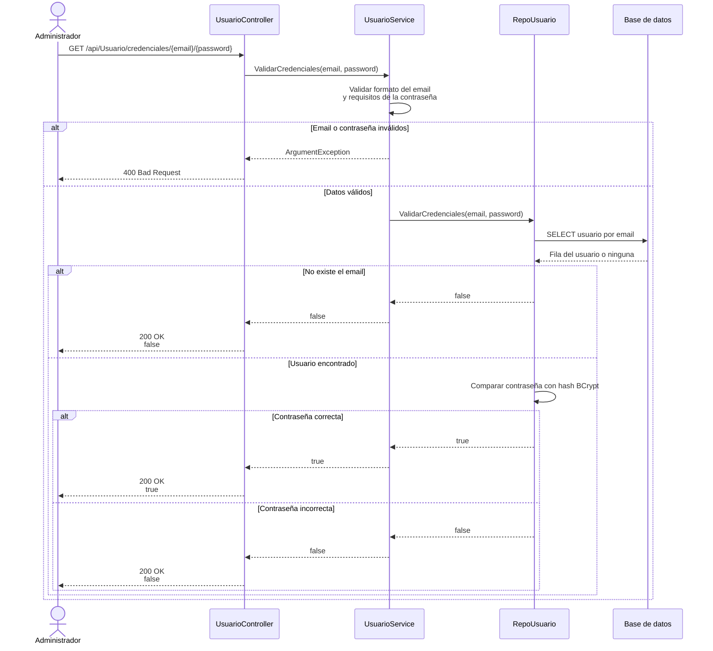

# Validar credenciales

```mermaid
sequenceDiagram
    actor Administrador
    participant API as UsuarioController
    participant Servicio as UsuarioService
    participant Repo as RepoUsuario
    participant BD as Base de datos

    Administrador->>API: GET /api/Usuario/credenciales/{email}/{password}
    API->>Servicio: ValidarCredenciales(email, password)
    Servicio->>Servicio: Validar formato del email<br/>y requisitos de la contraseña

    alt Email o contraseña inválidos
        Servicio-->>API: ArgumentException
        API-->>Administrador: 400 Bad Request
    else Datos válidos
        Servicio->>Repo: ValidarCredenciales(email, password)
        Repo->>BD: SELECT usuario por email
        BD-->>Repo: Fila del usuario o ninguna

        alt No existe el email
            Repo-->>Servicio: false
            Servicio-->>API: false
            API-->>Administrador: 200 OK<br/>false
        else Usuario encontrado
            Repo->>Repo: Comparar contraseña con hash BCrypt
            alt Contraseña correcta
                Repo-->>Servicio: true
                Servicio-->>API: true
                API-->>Administrador: 200 OK<br/>true
            else Contraseña incorrecta
                Repo-->>Servicio: false
                Servicio-->>API: false
                API-->>Administrador: 200 OK<br/>false
            end
        end
    end
```