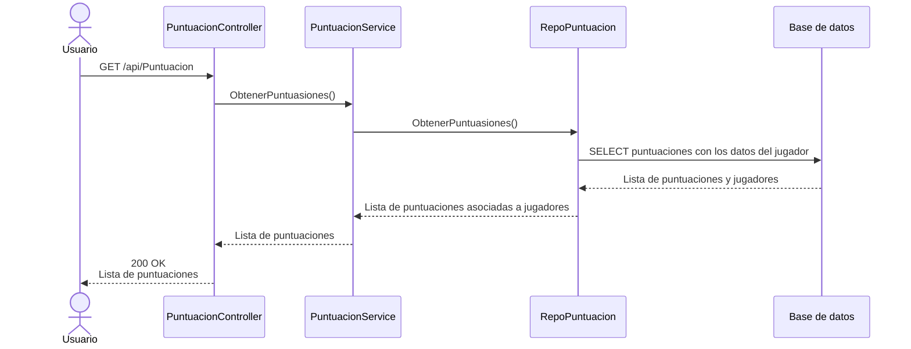

# Ver todas las puntuaciones

```mermaid
sequenceDiagram
    actor Usuario
    participant API as PuntuacionController
    participant Servicio as PuntuacionService
    participant Repo as RepoPuntuacion
    participant BD as Base de datos

    Usuario->>API: GET /api/Puntuacion
    API->>Servicio: ObtenerPuntuasiones()
    Servicio->>Repo: ObtenerPuntuasiones()
    Repo->>BD: SELECT puntuaciones con los datos del jugador
    BD-->>Repo: Lista de puntuaciones y jugadores
    Repo-->>Servicio: Lista de puntuaciones asociadas a jugadores
    Servicio-->>API: Lista de puntuaciones
    API-->>Usuario: 200 OK<br/>Lista de puntuaciones
```
