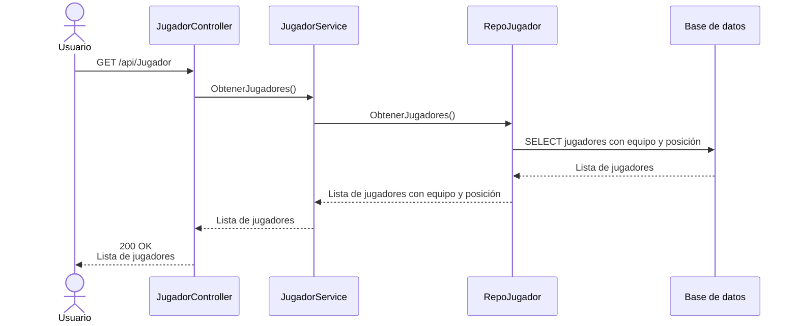

# Ver todos los jugadores

```mermaid
sequenceDiagram
    actor Usuario
    participant API as JugadorController
    participant Servicio as JugadorService
    participant Repo as RepoJugador
    participant BD as Base de datos

    Usuario->>API: GET /api/Jugador
    API->>Servicio: ObtenerJugadores()
    Servicio->>Repo: ObtenerJugadores()
    Repo->>BD: SELECT jugadores con equipo y posición
    BD-->>Repo: Lista de jugadores
    Repo-->>Servicio: Lista de jugadores con equipo y posición
    Servicio-->>API: Lista de jugadores
    API-->>Usuario: 200 OK<br/>Lista de jugadores
```
