# Diagrama de clases

Versión simplificada sin `PlantillaJugador`, manteniendo la estructura real del proyecto: modelos, interfaces, servicios, repositorios y relaciones principales.

```mermaid
classDiagram
    direction LR

    class Equipo {
        +byte IdEquipo
        +string Nombre
    }

    class Jugador {
        +short IdJugador
        +byte IdPosicion
        +int IdEquipo
        +string Nombre
        +string Apellido
        +string Apodo
        +DateTime Nacimiento
        +decimal Cotización
        +Posicion posicion
        +Equipo equipo
    }

    class Posicion {
        +byte IdPosicion
        +string Nombre
    }

    class Puntuacion {
        +short IdJugador
        +byte Fecha
        +decimal Puntuaciones
    }

    class Rol {
        +byte IdRol
        +string Nombre
    }

    class Usuario {
        +short IdUsuario
        +string Nombre
        +string Apellido
        +string Email
        +DateTime FechaNacimiento
        +string PasswordHash
        +byte IdRol
        +Rol Roles
    }

    class Plantilla {
        +int IdPlantilla
        +short IdUsuario
        +string Nombre
        +decimal Presupuesto
        +byte CantidadJugadores
        +List~Jugador~ JugadoresTitulares
        +List~Jugador~ JugadoresSuplentes
        +Usuario usuario
        +decimal costoTotalDeLaPlantilla()
        +bool validarposiciones()
    }

    class EquipoController {
        <<pendiente>>
    }

    class JugadorController {
        <<pendiente>>
    }

    class PlantillaController {
        <<pendiente>>
    }

    class PosicionController {
        <<pendiente>>
    }

    class PuntuacionController {
        <<pendiente>>
    }

    class RolController {
        <<pendiente>>
    }

    class UsuarioController {
        +ObtenerUsuarios()
        +ObtenerPorEmail(short id)
        +RegistrarUsario(Usuario usuario, string PasswordHash)
        +ActualizarUsuario(short id, Usuario usuario)
        +EliminarUsuario(short id)
    }

    class EquipoService {
        +ObtenerEquipos() IEnumerable~Equipo~
        +ObtenerEquipoPorId(byte idEquipo) Equipo
        +AgregarEquipo(Equipo equipo)
        +ActualizarEquipo(Equipo equipo)
        +EliminarEquipo(byte idEquipo)
    }

    class JugadorService {
        +ObtenerJugadores() IEnumerable~Jugador~
        +ObtenerJugadorPorId(short id) Jugador
        +AgregarJugador(Jugador jugador)
        +ActualizarJugador(Jugador jugador)
    }

    class PlantillaService {
        +ObtenerPlantillas() IEnumerable~Plantilla~
        +ObtenerPlantillaPorId(int id) Plantilla
        +AgregarPlantilla(Plantilla plantilla)
        +ActualizarPlantilla(Plantilla plantilla)
    }

    class PosicionService {
        +ObtenerPosiciones() IEnumerable~Posicion~
        +ObtenerPosicionPorId(byte id) Posicion
        +AgregarPosicion(Posicion posicion)
        +ActualizarPosicion(Posicion posicion)
    }

    class PuntuacionService {
        <<pendiente>>
    }

    class RolService {
        +ObtenerRoles() IEnumerable~Rol~
        +ObtenerRolPorId(byte id) Rol
        +AgregarRol(Rol rol)
        +ActualizarRol(Rol rol)
    }

    class UsuarioService {
        +ObtenerUsuarios() IEnumerable~Usuario~
        +ObtenerPorEmail(short id) Usuario
        +RegistrarUsario(Usuario usuario, string PasswordHash)
        +ActualizarUsuario(Usuario usuario)
        +EliminarUsuario(short id)
    }

    class IRepoEquipo {
        <<interface>>
        +ObtenerEquipos() IEnumerable~Equipo~
        +ObtenerEquipoPorId(byte id) Equipo
        +AgregarEquipo(Equipo equipo)
        +ActualizarEquipo(Equipo equipo)
        +EliminarEquipo(byte id)
    }

    class IRepoJugador {
        <<interface>>
        +ObtenerJugadores() IEnumerable~Jugador~
        +ObtenerJugadorPorId(short id) Jugador
        +AgregarJugador(Jugador jugador)
        +ActualizarJugador(Jugador jugador)
        +EliminarJugador(short id)
    }

    class IRepoPlantilla {
        <<interface>>
        +ObtenerPlantillas() IEnumerable~Plantilla~
        +ObtenerPlantillaPorId(int id) Plantilla
        +AgregarPlantilla(Plantilla plantilla)
        +ActualizarPlantilla(Plantilla plantilla)
        +EliminarPlantilla(int id)
        +AgregarJugadorAPlantilla(int idPlantilla, int idJugador, bool esTitular)
        +ActualizarJugadorEnPlantilla(int idPlantilla, int idJugador, bool esTitular)
        +EliminarJugadorDePlantilla(short idJugador, int idPlantilla)
        +ObtenerJugadoresDeLaPlantilla(int idPlantilla) Plantilla
        +ObtenerPuntuacionPromedioDeLosTitularesDeLaPlantilla(int idPlantilla, DateTime fecha) decimal
    }

    class IRepoPosicion {
        <<interface>>
        +ObtenerPosiciones() IEnumerable~Posicion~
        +ObtenerPosicionPorId(byte id) Posicion
        +AgregarPosicion(Posicion posicion)
        +ActualizarPosicion(Posicion posicion)
        +EliminarPosicion(byte id)
    }

    class IRepoPuntuacion {
        <<interface>>
        +ObtenerPuntuasiones() IEnumerable~Puntuacion~
        +ObtenerLaPuntucionDelJugador(short idJugador, byte fecha) Puntuacion
        +ObtenerTodasLasPuntuasionesDelJugador(short idJugador) IEnumerable~Puntuacion~
        +AgregarPuntuacion(Puntuacion puntuacion)
        +ActualizarPuntuacion(Puntuacion puntuacion)
        +EliminarPuntuacion(short idJugador)
    }

    class IRepoRol {
        <<interface>>
        +ObtenerRoles() IEnumerable~Rol~
        +ObtenerRolPorId(byte id) Rol
        +AgregarRol(Rol rol)
        +ActualizarRol(Rol rol)
        +EliminarRol(byte id)
    }

    class IRepoUsuario {
        <<interface>>
        +ObtenerUsuarios() IEnumerable~Usuario~
        +ObtenerPorEmail(short id) Usuario
        +RegistrarUsario(Usuario usuario, string PasswordHash)
        +EliminarUsuario(short id)
        +ActualizarUsuario(Usuario usuario)
    }

    class RepoDapper {
        #IDbConnection _conexion
        #RepoDapper(IDbConnection conexion)
        #AsignarParametros(Action~DynamicParameters~ configuracion) DynamicParameters
    }

    class RepoEquipo
    class RepoJugador
    class RepoPlantilla
    class RepoPosicion
    class RepoPuntuacion
    class RepoRol
    class RepoUsuario

    EquipoController --> EquipoService
    JugadorController --> JugadorService
    PlantillaController --> PlantillaService
    PosicionController --> PosicionService
    PuntuacionController --> PuntuacionService
    RolController --> RolService
    UsuarioController --> UsuarioService

    EquipoService --> IRepoEquipo
    JugadorService --> IRepoJugador
    PlantillaService --> IRepoPlantilla
    PosicionService --> IRepoPosicion
    PuntuacionService --> IRepoPuntuacion
    RolService --> IRepoRol
    UsuarioService --> IRepoUsuario

    RepoEquipo ..|> IRepoEquipo
    RepoJugador ..|> IRepoJugador
    RepoPlantilla ..|> IRepoPlantilla
    RepoPosicion ..|> IRepoPosicion
    RepoPuntuacion ..|> IRepoPuntuacion
    RepoRol ..|> IRepoRol
    RepoUsuario ..|> IRepoUsuario

    RepoEquipo --|> RepoDapper
    RepoJugador --|> RepoDapper
    RepoPlantilla --|> RepoDapper
    RepoPosicion --|> RepoDapper
    RepoPuntuacion --|> RepoDapper
    RepoRol --|> RepoDapper
    RepoUsuario --|> RepoDapper

    Equipo "1" <-- "0..*" Jugador : pertenece a
    Posicion "1" <-- "0..*" Jugador : clasifica
    Rol "1" <-- "0..*" Usuario : asignado a
    Usuario "1" <-- "0..*" Plantilla : propietario
    Plantilla "1" --> "0..*" Jugador : incluye titulares y suplentes
    Jugador "1" --> "0..*" Puntuacion : recibe
```



La idea es dejar el diagrama más legible y centrado en lo que sí existe en el proyecto: `Jugador`, `Plantilla`, `Equipo`, `Posicion`, `Usuario`, `Rol` y `Puntuacion`, sin la entidad intermedia `PlantillaJugador`.

	Equipo "1" <-- "0..*" Jugador : pertenece a
	Posicion "1" <-- "0..*" Jugador : clasifica
	Rol "1" <-- "0..*" Usuario : asignado a
	Usuario "1" <-- "0..*" Plantilla : propietario
	Plantilla "1" <-- "0..*" PlantillaJugador : contiene
	Jugador "1" <-- "0..*" PlantillaJugador : incluido en
	Jugador "1" <-- "0..*" Puntuacion : recibe
```

Las relaciones de `PlantillaJugador` representan la asociación muchos-a-muchos entre `Plantilla` y `Jugador`; cada registro además indica si el jugador es titular. En el código actual esa gestión está concentrada en `IRepoPlantilla` y `RepoPlantilla`, por lo que las capas propias de `PlantillaJugador` aparecen como pendientes. `PuntuacionService` y `PuntuacionController` también quedan pendientes, aunque su repositorio y su interfaz ya existen.
