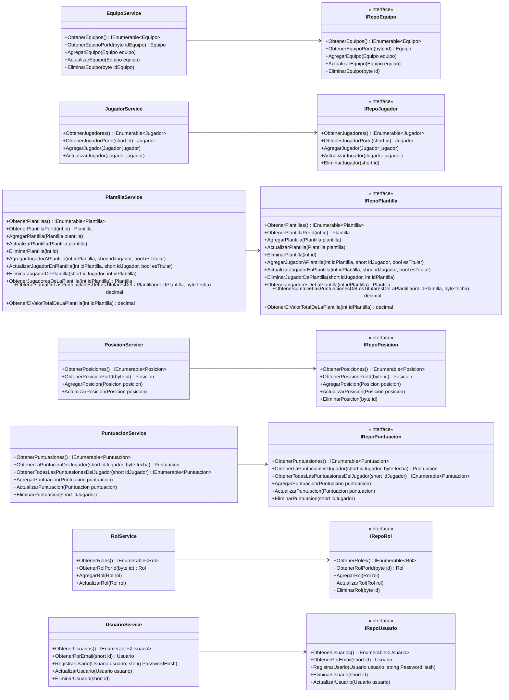

# Diagramas de clase de la Relacion de IRepos y los repos

Digrama de clase del del sistema Gran_ET12, con solo las relaciones entre Las interfaces y los services

```mermaid
classDiagram
    direction LR
    class IRepoEquipo {
        <<interface>>
        +ObtenerEquipos() IEnumerable~Equipo~
        +ObtenerEquipoPorId(byte id) Equipo
        +AgregarEquipo(Equipo equipo)
        +ActualizarEquipo(Equipo equipo)
        +EliminarEquipo(byte id)
    }

    class IRepoJugador {
        <<interface>>
        +ObtenerJugadores() IEnumerable~Jugador~
        +ObtenerJugadorPorId(short id) Jugador
        +AgregarJugador(Jugador jugador)
        +ActualizarJugador(Jugador jugador)
        +EliminarJugador(short id)
    }

    class IRepoPlantilla {
        <<interface>>
        +ObtenerPlantillas() IEnumerable~Plantilla~
        +ObtenerPlantillaPorId(int id) Plantilla
        +AgregarPlantilla(Plantilla plantilla)
        +ActualizarPlantilla(Plantilla plantilla)
        +EliminarPlantilla(int id)
        +AgregarJugadorAPlantilla(int idPlantilla, short idJugador, bool esTitular)
        +ActualizarJugadorEnPlantilla(int idPlantilla, short idJugador, bool esTitular)
        +EliminarJugadorDePlantilla(short idJugador, int idPlantilla)
        +ObtenerJugadoresDeLaPlantilla(int idPlantilla) Plantilla
        +ObtenersumaDeLasPuntuacionesDeLosTitularesDeLaPlantilla(int idPlantilla, byte fecha) decimal
        +ObtenerElValorTotalDeLaPlantilla(int idPlantilla) decimal
    }

    class IRepoPosicion {
        <<interface>>
        +ObtenerPosiciones() IEnumerable~Posicion~
        +ObtenerPosicionPorId(byte id) Posicion
        +AgregarPosicion(Posicion posicion)
        +ActualizarPosicion(Posicion posicion)
        +EliminarPosicion(byte id)
    }

    class IRepoPuntuacion {
        <<interface>>
        +ObtenerPuntuasiones() IEnumerable~Puntuacion~
        +ObtenerLaPuntucionDelJugador(short idJugador, byte fecha) Puntuacion
        +ObtenerTodasLasPuntuasionesDelJugador(short idJugador) IEnumerable~Puntuacion~
        +AgregarPuntuacion(Puntuacion puntuacion)
        +ActualizarPuntuacion(Puntuacion puntuacion)
        +EliminarPuntuacion(short idJugador)
    }

    class IRepoRol {
        <<interface>>
        +ObtenerRoles() IEnumerable~Rol~
        +ObtenerRolPorId(byte id) Rol
        +AgregarRol(Rol rol)
        +ActualizarRol(Rol rol)
        +EliminarRol(byte id)
    }

    class IRepoUsuario {
        <<interface>>
        +ObtenerUsuarios() IEnumerable~Usuario~
        +ObtenerPorEmail(short id) Usuario
        +RegistrarUsario(Usuario usuario, string PasswordHash)
        +EliminarUsuario(short id)
        +ActualizarUsuario(Usuario usuario)
    }


    class EquipoService {
        +ObtenerEquipos() IEnumerable~Equipo~
        +ObtenerEquipoPorId(byte idEquipo) Equipo
        +AgregarEquipo(Equipo equipo)
        +ActualizarEquipo(Equipo equipo)
        +EliminarEquipo(byte idEquipo)
    }

    class JugadorService {
        +ObtenerJugadores() IEnumerable~Jugador~
        +ObtenerJugadorPorId(short id) Jugador
        +AgregarJugador(Jugador jugador)
        +ActualizarJugador(Jugador jugador)
    }

    class PlantillaService {
        +ObtenerPlantillas() IEnumerable~Plantilla~
        +ObtenerPlantillaPorId(int id) Plantilla
        +AgregarPlantilla(Plantilla plantilla)
        +ActualizarPlantilla(Plantilla plantilla)
        +EliminarPlantilla(int id)
        +AgregarJugadorAPlantilla(int idPlantilla, short idJugador, bool esTitular)
        +ActualizarJugadorEnPlantilla(int idPlantilla, short idJugador, bool esTitular)
        +EliminarJugadorDePlantilla(short idJugador, int idPlantilla)
        +ObtenerJugadoresDeLaPlantilla(int idPlantilla) Plantilla
        +ObtenersumaDeLasPuntuacionesDeLosTitularesDeLaPlantilla(int idPlantilla, byte fecha) decimal
        +ObtenerElValorTotalDeLaPlantilla(int idPlantilla) decimal
    }

    class PosicionService {
        +ObtenerPosiciones() IEnumerable~Posicion~
        +ObtenerPosicionPorId(byte id) Posicion
        +AgregarPosicion(Posicion posicion)
        +ActualizarPosicion(Posicion posicion)
    }

    class PuntuacionService {
        +ObtenerPuntuasiones() IEnumerable~Puntuacion~
        +ObtenerLaPuntucionDelJugador(short idJugador, byte fecha) Puntuacion
        +ObtenerTodasLasPuntuasionesDelJugador(short idJugador) IEnumerable~Puntuacion~
        +AgregarPuntuacion(Puntuacion puntuacion)
        +ActualizarPuntuacion(Puntuacion puntuacion)
        +EliminarPuntuacion(short idJugador)
    }

    class RolService {
        +ObtenerRoles() IEnumerable~Rol~
        +ObtenerRolPorId(byte id) Rol
        +AgregarRol(Rol rol)
        +ActualizarRol(Rol rol)
    }

    class UsuarioService {
        +ObtenerUsuarios() IEnumerable~Usuario~
        +ObtenerPorEmail(short id) Usuario
        +RegistrarUsario(Usuario usuario, string PasswordHash)
        +ActualizarUsuario(Usuario usuario)
        +EliminarUsuario(short id)
    }

    EquipoService --> IRepoEquipo
    JugadorService --> IRepoJugador
    PlantillaService --> IRepoPlantilla
    PosicionService --> IRepoPosicion
    PuntuacionService --> IRepoPuntuacion
    RolService --> IRepoRol
    UsuarioService --> IRepoUsuario

```