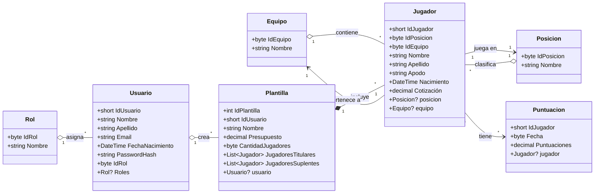

# Diagrama de clases - Models

```mermaid
classDiagram
    direction LR
    class Equipo {
        +byte IdEquipo
        +string Nombre
    }

    class Posicion {
        +byte IdPosicion
        +string Nombre
    }

    class Rol {
        +byte IdRol
        +string Nombre
    }

    class Usuario {
        +short IdUsuario
        +string Nombre
        +string Apellido
        +string Email
        +DateTime FechaNacimiento
        +string PasswordHash
        +byte IdRol
        +Rol? Roles
    }

    class Jugador {
        +short IdJugador
        +byte IdPosicion
        +byte IdEquipo
        +string Nombre
        +string Apellido
        +string Apodo
        +DateTime Nacimiento
        +decimal Cotización
        +Posicion? posicion
        +Equipo? equipo
    }

    class Plantilla {
        +int IdPlantilla
        +short IdUsuario
        +string Nombre
        +decimal Presupuesto
        +byte CantidadJugadores
        +List~Jugador~ JugadoresTitulares
        +List~Jugador~ JugadoresSuplentes
        +Usuario? usuario
    }

    class Puntuacion {
        +short IdJugador
        +byte Fecha
        +decimal Puntuaciones
        +Jugador? jugador
    }

    Equipo "1" o-- "*" Jugador : contiene
    Posicion "1" o-- "*" Jugador : clasifica
    Rol "1" o-- "*" Usuario : asigna
    Usuario "1" o-- "*" Plantilla : crea
    Plantilla "1" *-- "*" Jugador : incluye
    Jugador "1" --> "1" Equipo : pertenece a
    Jugador "1" --> "1" Posicion : juega en
    Jugador "1" --> "*" Puntuacion : tiene
```
